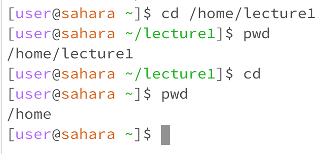
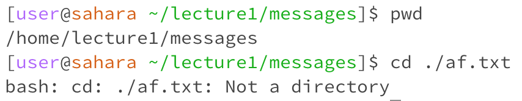
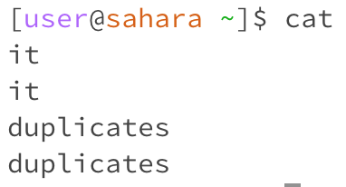
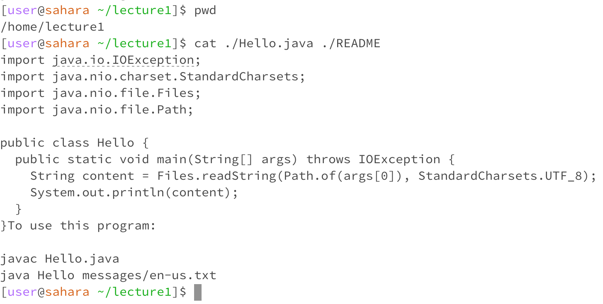

Ryan Ryu - CSE 15L Lab1 Report
---
Hi everyone, this is Ryan and today I'm going to be talking about a few commands to use in terminal: *cd*, *ls*, and *cat*.
In this specific blog post, we're gonna be looking at this simple file structure.

---
# `cd (Change Directory)` switches the current working direcetory to the given path.
## 1) When it is used with no arguments,
   - it defaults to the root directory, which in this case is */home*.
     
   - As you can see in the picture, the working directory was */home/lecture1* when the command was run, but it defaulted to */home* when *cd* was run without arguments.
   - This is because when *cd* is used without arguments, it indicates to the terminal that it wants to redirect to home directory.
   - Using *cd* without arguments do not generate an error. 
  
## 2) When it is used with a path to directory as an argument,
   - it redirects the working directory to the directory that is used as the arguement.
     
   - In this case, the working directory was /home. But when it is redirectred to the path *./lecture1*, it swtiches the working directory to */home/lecture1*
  
## 3) When it is used with a path to file as an argumemt,
   - It generates an error.
     
   - The working directory was /home/lecture1/messages. When it is redirected to a file using *cd ./af.txt*, it generated an error.
   - This is because cd only changes to 'directories', but the file.
   - Thus, it generates an error noting that *af.txt* is 'Not a directory'.

---
# `ls (List)` lists the files and folders in the given path.
## 1) When it is used with no arguments,
   - it lists the items in the given path.
     
   - In this case, it listed each text file in the */messages* directory.
   - The working directory was */home/lecture1/messages*, and it remained the same throughout the command. It only lists the files and folders in this directory and does not change the directory.
   - It does not generate an error.
   
## 2) When it is used with a path to directory as an argument,
   - it shows the items in that directory.
     
   - In this image, it shows the items in the */home* directory.
   - the working directory was */home*, and it stays the same after the command.
   - This output was generated because ls command lists the items in a given path.
   - It does not generate an error.
   
## 3) When it is used with a path to file as an argumemt,
   - It just restates the name of the directory of the file.
     
   - In this image, it only shows the directory of the exact file that was used as the argument, which is */home/lecture1/messages/af.txt*.
   - The working directory stayed the same throughout the command.
   - I got this output because you cannot list the files inside a file. There is only one item to be displayed, which is the file itself.
   - It does not generate an error. However, it also does not list the files in the given file because it is impossible.

---  
# `cat (Concatenate)` prints the contents of one or more files provided by the paths
## 1) When it is used with no arguments,
   - It duplicates your input until you exit by pressing Ctrl + D.
     
   - It duplicated 'it' and 'duplicates' which I typed in.
   - It does this because it is instructed to print out my input.
   - The working directory remains the same.
   - It does not generate an error.

## 2) When it is used with a path to directory as an argument,
   - It states whether the given path is a directory or not. 
     
   - In this example, it says *./messages* is a directory.
   - The working directory still stays */home/lecture1*.
   - I got this output because for directories, it displays whether or not it is a directory.
   - It does not generate an error.
   
## 3) When it is used with a path to file as an argumemt,
   - It shows the contents of the given file used as arguments.
     
   - It printed out the contents of both *Hello.java* and *README*.
   - The working directory did not change.
   - *cat* printed out the contents, because files are used as arguments.
   - It does not generate an error.
   
