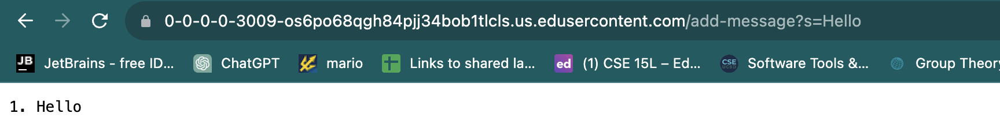

## Part 1
### StringServer.java
```
import java.util.*;
import java.io.IOException;
import java.net.URI;
import java.net.URLDecoder;
import java.nio.charset.StandardCharsets;

class Handler implements URLHandler {
    //Adds messages the user types in each time and displays them in order
    
    ArrayList<String> message = new ArrayList<String> ();
    int num = 0; //incremented every time a new input is added
    String output = ""; //What's displayed on the screen

    public String handleRequest(URI url) {
        if (url.getPath().equals("/add-message")) {
            String [] parameters = url.getQuery().split("=");
            if (parameters[0].equals("s")){
                String message = URLDecoder.decode(parameters[1], StandardCharsets.UTF_8);
                num++; 
                output += String.format("%d. %s\n", num, message); //Output Concatenated with a previous output
                return output;
            } 
        }
            return "404 not found!";
        
    }
}
class StringServer {
    public static void main(String[] args) throws IOException {
        if(args.length == 0){
            System.out.println("Missing port number! Try any number between 1024 to 49151");
            return;
        }

        int port = Integer.parseInt(args[0]);

        Server.start(port, new Handler());
    }
}
```

### Using `add-message?s=Hello` as a query.

- 

### Using `/add-message?s=How%20are%20you` as a query.
)

## Part2


## Part 3
Before week 2, I did not even know what a server is. Now I learned how servers and clients are connected and I can do that on my terminal using commands. Also, being able to remotely sign in and control a computer distant from my location was interesting to learn. For week 3, I had a little bit of experience with VS code but never run a terminal on it, so that was new to me. Learning how to learn ssh-keygen was very new to me and I think it is going to be useful in the future.
