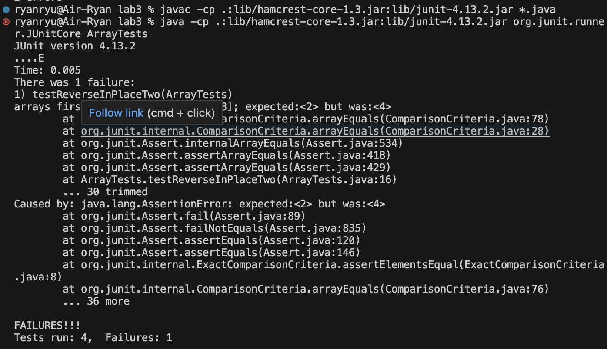

## Part 1
I chose the bug in the `reverseInPlace` method in the `ArrayExamples` class.
### Failure-inducing input in the new method `testReverseInPlaceTwo` in the `ArraryTests` class

```
@Test
public void testReverseInPlaceTwo() {
    int[] input1 = {1, 2, 3, 4, 5};
    ArrayExamples.reverseInPlace(input1);
    assertArrayEquals(new int[]{5, 4, 3, 2, 1}, input1);
	}
```

### An input in the new method `testReverseInPlaceThree` that doesn't induce a failure in the `ArrayTests` class.

```
@Test 
	public void testReverseInPlaceThree() {
    int[] input1 = { 4 };
    ArrayExamples.reverseInPlace(input1);
    assertArrayEquals(new int[]{ 4 }, input1);
	}
```
### When it was run with a JUnit test with the two inputs above, the following result was generated


### The code for `reverseInPlace` method before fix
```
static void reverseInPlace(int[] arr) {
    for(int i = 0; i < arr.length; i += 1) {
      arr[i] = arr[arr.length - i - 1];
    }
  }
```
- This is the one with the bug as it would switch the elements in the array only half way up, and then the second half of the array starys the same. This is because it would reverse the reversed version of the elements, putting them in their original position. 

### The code for `reverseInplace` method after fix	
```
static void reverseInPlace(int[] arr) {
    for(int i = 0; i < arr.length / 2; i++) {
        int temp = arr[i];
        arr[i] = arr[arr.length - i - 1];
        arr[arr.length - i - 1] = temp;
    }
}
```
- This version fully changes the input of the array in reversed order as I added a new variable `temp`. For elements at index `i`, it gets temporarily stored at `temp` and eventually gets stored at `arr[arr.length - i - 1]`, which effectively reversed the order of the whole array.

## Part 2 
### Command of choice: `find`
- Options of choice: `-type`, `-size`, `-name`, and `-ls`. I found these options by using `man find` command on terminal.
- For the following examples, the working directory is `/Users/ryanryu/docsearch/technical`
  
### `-path` option
- `find -path "*/<filename>` finds the specific file I am looking for.
```
ryanryu@Air-Ryan technical % find . -path "*/chapter-9.txt"
./911report/chapter-9.txt
```

- `find -path "*<directory name>*` find the files that name a certain directory in their path.
```
ryanryu@Air-Ryan technical % find . -path "*911report*"
./911report
./911report/chapter-13.4.txt
./911report/chapter-13.5.txt
./911report/chapter-13.1.txt
./911report/chapter-13.2.txt
./911report/chapter-13.3.txt
./911report/chapter-3.txt
./911report/chapter-2.txt
./911report/chapter-1.txt
./911report/chapter-5.txt
./911report/chapter-6.txt
./911report/chapter-7.txt
./911report/chapter-9.txt
./911report/chapter-8.txt
./911report/preface.txt
./911report/chapter-12.txt
./911report/chapter-10.txt
./911report/chapter-11.txt
```

### `-size` option
- `find <path to directory> -size <file size>` finds files that are exaclt the specified file size.
```
ryanryu@Air-Ryan technical % find . -size 71151c
./911report/chapter-11.txt
```

- `find <path to directory> -size +<file size>` finds files larger than the specified file size.
```
ryanryu@Air-Ryan technical % find . -size +150k
./government/About_LSC/commission_report.txt
./government/Env_Prot_Agen/multi102902.txt
./government/Env_Prot_Agen/bill.txt
./government/Env_Prot_Agen/tech_adden.txt
./government/Gen_Account_Office/GovernmentAuditingStandards_yb2002ed.txt
./government/Gen_Account_Office/Statements_Feb28-1997_volume.txt
./government/Gen_Account_Office/pe1019.txt
./government/Gen_Account_Office/d01591sp.txt
./911report/chapter-13.4.txt
./911report/chapter-13.5.txt
./911report/chapter-3.txt
```

### `-name` option
- `find <path to directory> -name "<file name>"` locates the exact file from the given file name in the directory.

```
ryanryu@Air-Ryan technical % find . -name "chapter-3.txt"

./911report/chapter-3.txt
```

- `find <path to directory> -name "<known file name><as many ?'s of number of unknown characters of file name>"` shows the files with the partial file name given and matches the number of ?'s given in the directory.
```
ryanryu@Air-Ryan technical % find . -name "1468-6708????.txt"
./biomed/1468-6708-3-4.txt
./biomed/1468-6708-3-7.txt
./biomed/1468-6708-3-3.txt
./biomed/1468-6708-3-1.txt
```

### `-ls` option
- `find <path to directory> -name "<file/directory name> -ls` gives a detailed information of the item of given type in the directory.
```
ryanryu@Air-Ryan technical % find . -name "ffm.txt" -ls 

1388680       56 -rwxr-xr-x    1 ryanryu          staff               26946 Oct 31 16:15 ./government/Gen_Account_Office/ffm.txt

```

- `find <path to directory> -type <type> -ls` gives a detailed listing of the item of given type in the directory.
```
ryanryu@Air-Ryan technical % find . -type d -ls
1387753        0 drwxr-xr-x    7 ryanryu          staff                 224 Nov  5 22:35 .
1388610        0 drwxr-xr-x    8 ryanryu          staff                 256 Oct 31 16:15 ./government
1388611        0 drwxr-xr-x   19 ryanryu          staff                 608 Oct 31 16:15 ./government/About_LSC
1388634        0 drwxr-xr-x   16 ryanryu          staff                 512 Oct 31 16:15 ./government/Env_Prot_Agen
1388629        0 drwxr-xr-x    6 ryanryu          staff                 192 Oct 31 16:15 ./government/Alcohol_Problems
1388649        0 drwxr-xr-x   93 ryanryu          staff                2976 Oct 31 16:15 ./government/Gen_Account_Office
1388887        0 drwxr-xr-x   16 ryanryu          staff                 512 Oct 31 16:15 ./government/Post_Rate_Comm
1388741        0 drwxr-xr-x  147 ryanryu          staff                4704 Oct 31 16:15 ./government/Media
1388902        0 drwxr-xr-x  254 ryanryu          staff                8128 Oct 31 16:15 ./plos
1387772        0 drwxr-xr-x  839 ryanryu          staff               26848 Oct 31 16:15 ./biomed
1387754        0 drwxr-xr-x   19 ryanryu          staff                 608 Oct 31 16:15 ./911report
```


