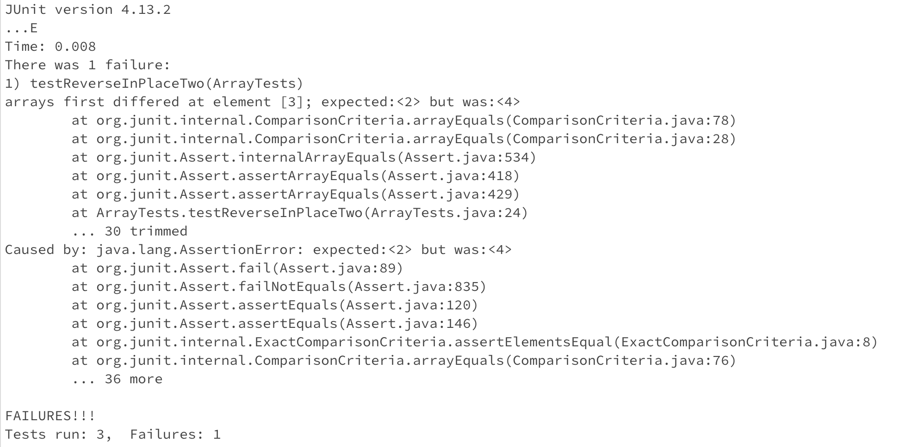

## Part 1
I chose the bug in the `reverseInPlace` method in the `ArrayExamples` class.
### Failure-inducing input in the new method `testReverseInPlaceTwo` in the `ArraryTests` class

```
@Test
public void testReverseInPlaceTwo() {
    int[] input1 = {1, 2, 3, 4, 5};
    ArrayExamples.reverseInPlace(input1);
    assertArrayEquals(new int[]{5, 4, 3, 2, 1}, input1);
	}
```

### An input in the new method `testReverseInPlaceThree` that doesn't induce a failure in the `ArrayTests` class.

```
@Test 
	public void testReverseInPlaceThree() {
    int[] input1 = { 4 };
    ArrayExamples.reverseInPlace(input1);
    assertArrayEquals(new int[]{ 4 }, input1);
	}
```
### When it was run with a JUnit test with the two inputs above, the following result was generated



## Part 2
