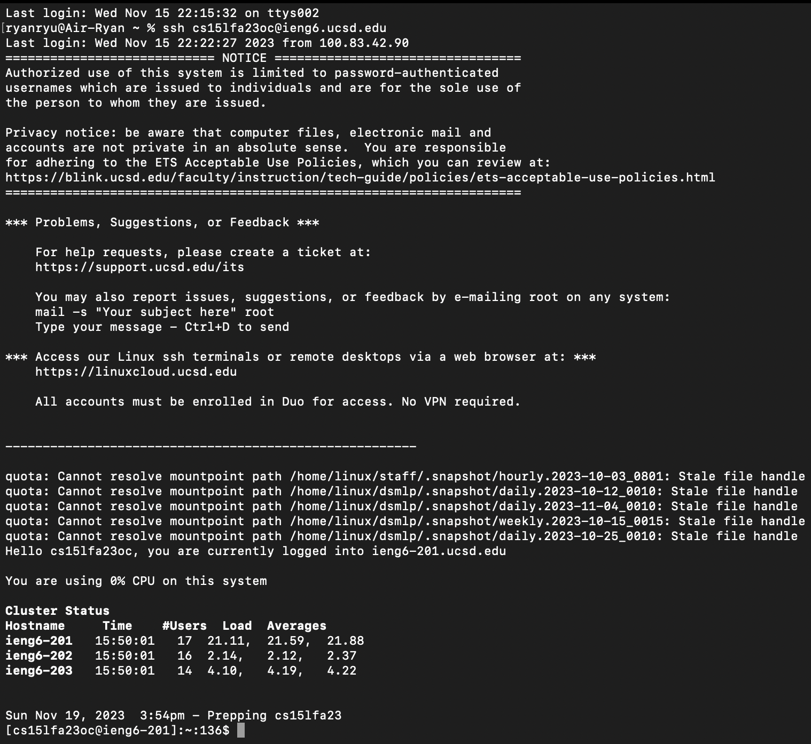
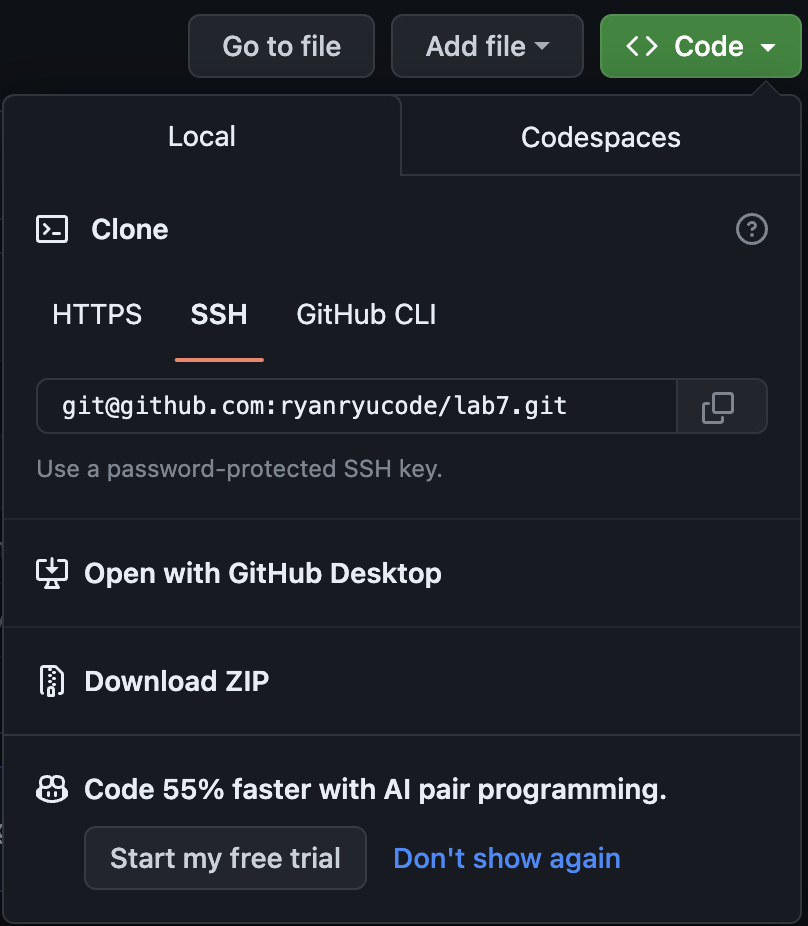

## Step 4
To log into remote account, I typed `ssh` then pressed the up arrow once. From the terminal history, my command was autofilled with `ssh cs15lfa23oc@ieng6.ucsd.edu`. Then I pressed `enter`. I could save a lot of key presses from using the up arrow than from typing `ssh cs15lfa23oc@ieng6.ucsd.edu <enter>`. Now I am logged into `ieng6`.

## Step 5
To `fork` the repository, I clicked on the `fork` button on the top right corner of the github page.

To clone using ssh, I clicked on the green `code` button and copied the `ssh` key using the copy button next to the `ssh url`. 

Then I typed `git clone` `command key`, `v`, `enter`. This generated a command `git clone git@github.com:ryanryucode/lab7.git`. From this, I was able to clone it successfully into my remote account.

## Step 6
When run the test with `bash test.sh <enter>`, the test gave output of failures.

## Step 7
In order to modify the code in ListExamples.java, I typed `vim ListExamples.java` <enter>, pressed 43 j's, 11 l's, and 
i, 2, ESC, l, then x consecutively. To save and quit, I pressed <:wq>. This inserts 2 in front of 1 and then deletes 1, successfully replaying 1 with 2.

## Step 8
When I run the `bash test.sh` again, the test finally passed. 

## Step 9
To update the github repository with the changes I made in the local repository, I used `git add ListExamples.java <enter>`, `git commit -m "third time" <enter>`, and then `git push <enter>` to push changes. I typed in the commands, instead of using copy and paste. 

.
