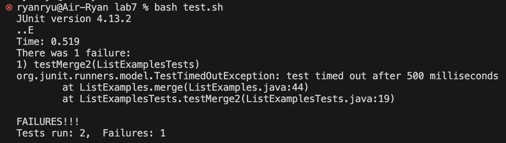
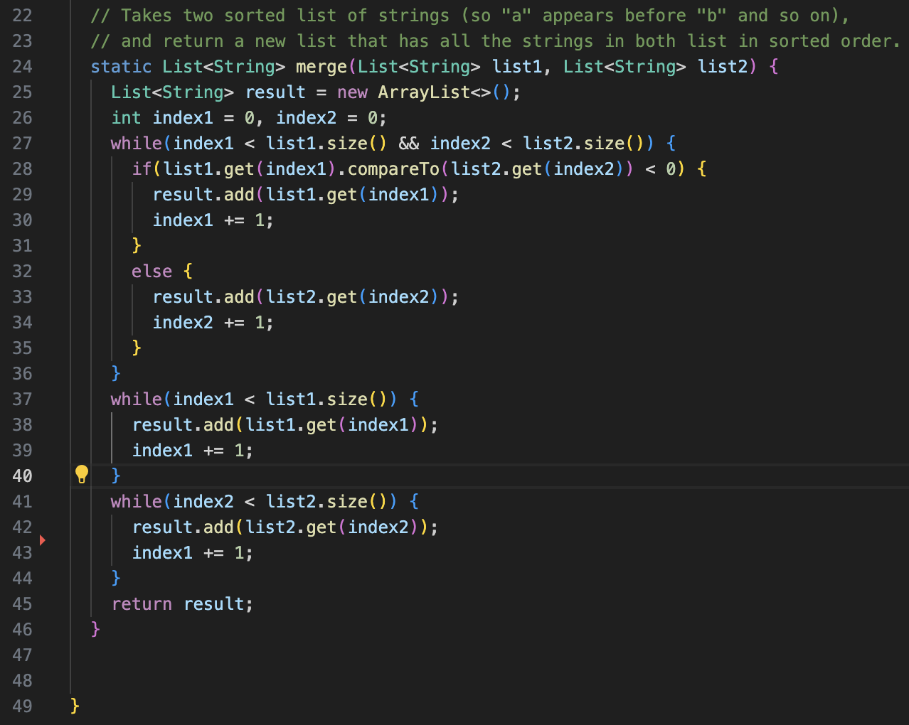
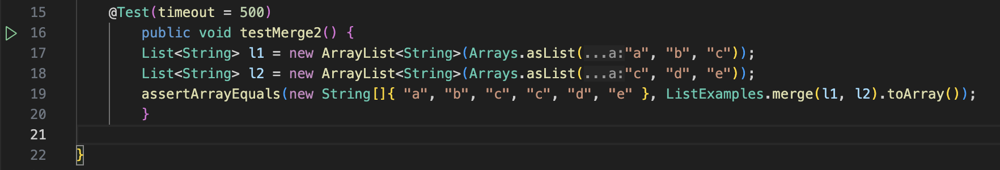
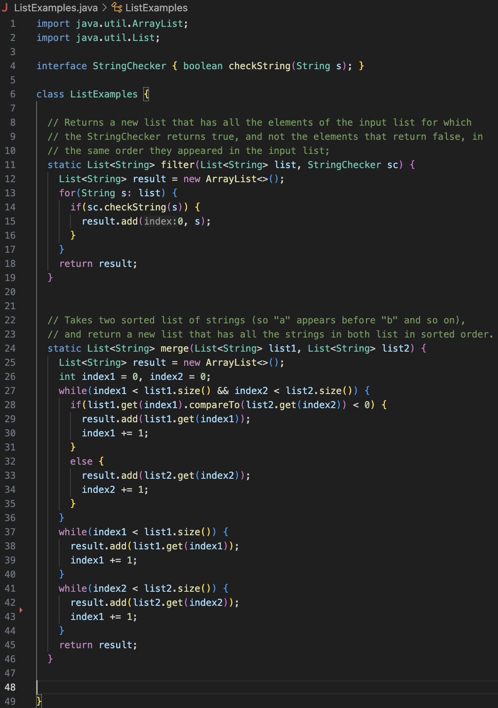
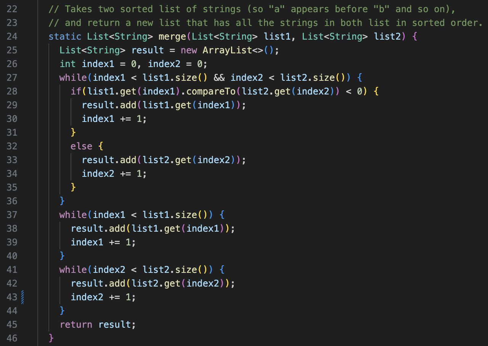
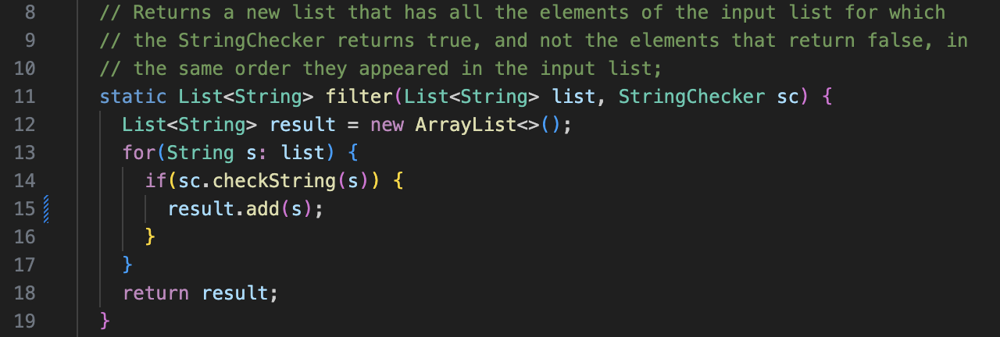
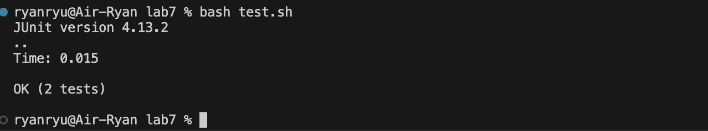

## Student's Post
Hi, I was curious why I keep getting this error message. I tried testing the `ListExamples.java` and `ListExamplesTests.java` file using `bash test.sh` command, but it keeps generating the `TestTimedOutException` error indicating the error occured at line 44 in the `merge` method of `ListExamples.java` and in the line 19 `testMerge2` method of `ListExamplesTests.java`. Could you help me fix these errors? I uploaded both the `merge` and `testMerge2` class. 

I am uploading the whole code of `ListExamples.java`, just in case the error is being generated in other areas.

## TA's Response
Hi there, the reason you're getting error messages is because you labelled the variable wrong in the `merge` method in `ListExamples.java`. Notice that the `merge` method in `ListExamples.java` aims to take two sorted list of strings and return a new list hat has all the strings in both list in sorted order. Replace `index1` in line 43 with a suitable variable that aligns with other variables in the third `while` method. Hint: the third while loop checks if the index reached at the end of `list2`, not `list1`.

Also, I noticed in your `filter` method in `ListExamples.java`, your code result.add(s) appends a new string `s` at the beginning of the string `result`. This does not match the description of the `filter` method. Your code prints out the reversed version of the expected output. Make a modification in line 15 so that it prints out `result` in the correct order.

## Follow-up by student

Thank you for your response. I replaced `index1` with `index2` in the line 43 of the `ListExamples` because the rest of the while loop is associated with `list2`. This way, the while loop correctly checks if the index reached at the end of `list2`. The bug came from labelling the variable wrongly.

Also, regarding the `filter` method, I put `result.add(s)` instead of `result.add(0,s)`. This way, the string `s` is correctly appended at the end of the string `result`, not the beginning of it. The bug came from indicating a wrong index in the code.

When I fixed these bugs, the test could finally be passed.

## Information about the setting
### The file and directory structure.
-lab7
-.gitignore
-lib
 -hamcrest-core-1.3.jar
 -junit-4.13.2.jar
-ListExamples.java
-ListExamplesTests.java
-test.sh

The contents before and after fixing the bug was already demonstrated in earlier parts of this lab report.
The changes I made were replacing `index1` with `index2`, and `result.add(0,s)` with `result.add(s)`, which are explained in Student's Post and Follow-up.

## 

