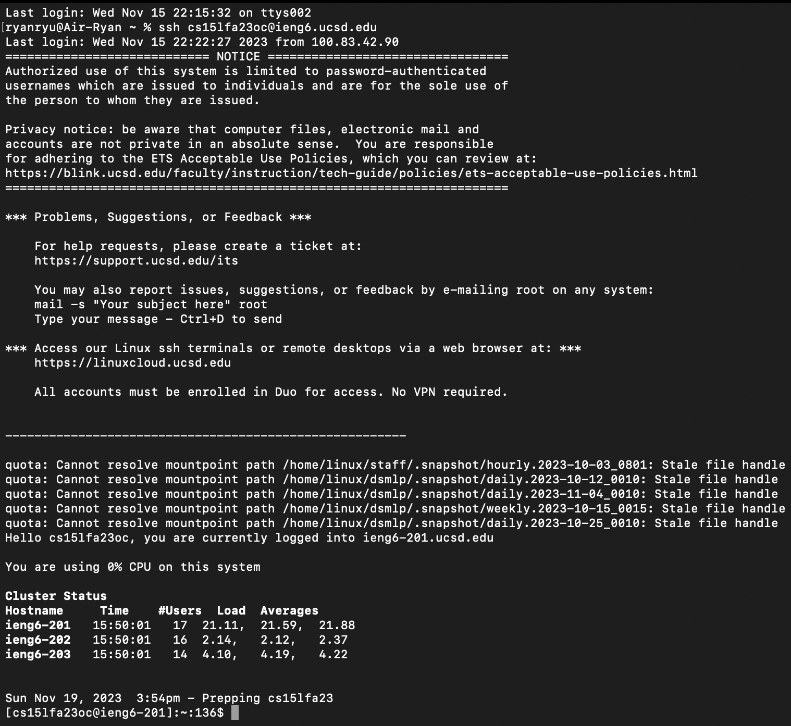
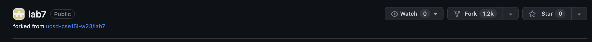
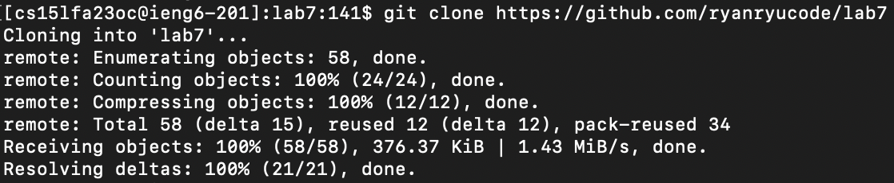
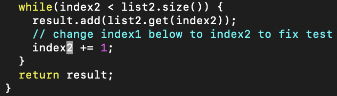
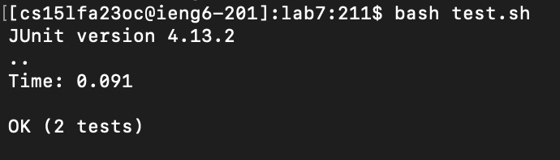
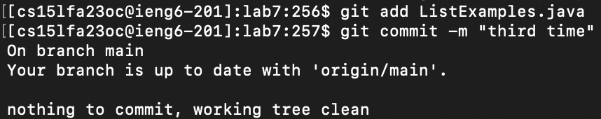

## Step 4
To log into remote account, I typed `ssh cs15lfa23oc@ieng6.ucsd.edu <enter>`.

## Step 5
To `fork` the repository, I clicked on the `fork` button on the top right corner of the github page.

To clone using ssh, I clicked on the green `code` button, copied the `ssh` key, and use `git clone` command to clone it into my remote account.

## Step 6
When run the test with `bash test.sh <enter>`, the test gave output of failures.

## Step 7
In order to modify the code in ListExamples.java, I typed `vim ListExamples.java` <enter>, pressed 43 <j>s, 11 <l>s, and 
<i>, <2>, <ESC>, <l>, <x>, consecutively. To save and quit, I pressed <:wq>.

## Step 8
When I run the `bash test.sh` again, the test finally passed. 

## Step 9
To update the github repository with the changes I made in the local repository, I used `git add ListExamples.java <enter>`, `git commit -m "<message>" <enter>`, and then `git push <enter>` to push changes.
.
